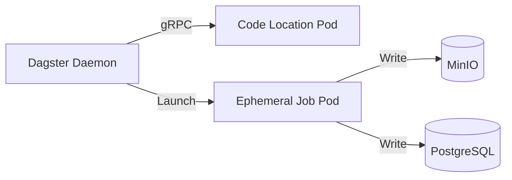

# Dagster Crypto Data Pipeline

[](https://www.python.org/downloads/)
[](https://dagster.io/)
[](LICENSE)

Production-grade cryptocurrency data pipeline orchestrated with Dagster. Extracts market data from exchanges, stores raw data in MinIO, transforms with Polars, and loads into PostgreSQL.

## 🚀 Quick Start

```bash
# Install dependencies
uv sync

# Start Dagster development server
uv run dagster dev
```

Visit http://localhost:3000 to access the Dagster UI.

> **Note**: For Kubernetes deployments that need to access external services (MinIO, databases) on custom domains like `.lan`, you may need to configure CoreDNS. See [DNS Configuration](docs/deployment.md#dns-configuration-for-external-services) for details.

## 📚 Documentation

**Comprehensive documentation is available in the `docs/` directory.**

To view the documentation locally:

```bash
# Serve documentation with MkDocs
./serve-docs.sh

# Or manually
uv run mkdocs serve
```

Then open http://127.0.0.1:8000 in your browser.

### Documentation Contents

- **[Home](docs/index.md)**: Project overview and quick start
- **[Architecture](docs/architecture.md)**: System design, data flow, and infrastructure
- **[Setup Guide](docs/setup.md)**: Environment setup and configuration
- **[Development Guide](docs/development.md)**: Development workflow and best practices
- **[Deployment Guide](docs/deployment.md)**: Kubernetes deployment and operations
- **[API Reference](docs/api/index.md)**: Code documentation and data contracts
- **[Troubleshooting](docs/troubleshooting.md)**: Common issues and solutions

## 🎯 Project Overview

This Dagster code location implements a production-grade data pipeline:

1. **Extract**: Fetch market data from cryptocurrency exchanges (Binance, ByBit, Gate.io)
2. **Load**: Store raw JSON data in MinIO (S3-compatible object storage)
3. **Transform**: Clean and validate data using Narwhals/Polars
4. **Load**: Store structured data in PostgreSQL for analytics

## ✨ Key Features

- **Type-Safe**: Comprehensive Pydantic models with validation
- **Tested**: 150+ unit and integration tests with 82% coverage
- **Observable**: Structured logging with contextual information
- **Resilient**: Retry logic, error handling, and graceful degradation
- **Scalable**: Kubernetes-native with K8sRunLauncher
- **Maintainable**: Clean code, comprehensive documentation
- **Flexible IO**: Multiple storage backends (Filesystem, S3/MinIO, DuckDB, PostgreSQL, SQLite, KuzuDB)

## 🛠️ Technology Stack

| Component | Technology |
|-----------|-----------|
| **Orchestration** | Dagster 1.12+ |
| **Data Processing** | Narwhals + Polars |
| **Data Validation** | Pydantic 2.12+ |
| **Exchange API** | CCXT 4.5+ |
| **Object Storage** | MinIO / S3 |
| **Database** | PostgreSQL 14+ |
| **Testing** | Pytest 9.0+ |
| **Container Runtime** | Kubernetes |

## 📋 Table of Contents (Legacy README)

## **TODO List**

### **Pipeline Implementation**
- [x] Implement extract asset factory with Pydantic validation
- [x] Implement transform asset factory with Narwhals/Polars
- [x] Add comprehensive test suites (150 tests passing, 82% coverage)
- [x] Create custom IO Managers (Filesystem, S3/MinIO, DuckDB, SQL, KuzuDB)
- [x] Implement Narwhals-compatible DataFrame interfaces
- [ ] Implement load asset factory for PostgreSQL
- [ ] Wire up complete extract → transform → load pipeline in Definitions

### **Data Quality & Governance**
- [ ] Add Soda Core data quality checks
- [ ] Define data contracts for ticker data
- [ ] Implement data validation rules (nulls, ranges, types)
- [ ] Add data quality tests between pipeline stages
- [ ] Create data lineage documentation

### **Infrastructure & DevOps**
- [ ] Create Dockerfile for containerized deployment
- [ ] Set up Kubernetes manifests (Helm + Kustomize)
- [ ] Configure K8sRunLauncher for job execution
- [ ] Implement secrets management (SealedSecrets)
- [ ] Add CI/CD pipeline (GitHub Actions)

### **Monitoring & Observability**
- [ ] Add pipeline monitoring and alerting
- [ ] Implement data freshness checks
- [ ] Create operational dashboards
- [ ] Add structured logging for all assets
- [ ] Set up error notification system

### **Documentation**
- [x] Create architecture diagram (D2 format)
- [x] Create comprehensive MkDocs documentation site
- [x] Document IO managers and data flow
- [x] Add API reference documentation
- [x] Create deployment guide
- [x] Document troubleshooting procedures
- [ ] Document data contracts and schemas
- [ ] Add pipeline runbooks for operations

### **Testing & Quality**
- [x] Create comprehensive test data fixtures
- [x] Add unit tests for all IO managers (46 tests)
- [x] Add unit tests for extract assets (23 tests)
- [x] Add unit tests for transform assets (17 tests)
- [x] Add unit tests for resources and utilities (64 tests)
- [x] Achieve 82% overall code coverage
- [ ] Add integration tests for full pipeline
- [ ] Implement data quality regression tests
- [ ] Add performance benchmarks
- [ ] Add end-to-end pipeline tests

### **Future Enhancements**
- [ ] Add support for additional exchanges (Kraken, Coinbase, etc.)
- [ ] Implement incremental data loading
- [ ] Add data versioning with lakeFS
- [ ] Create semantic layer with Cube
- [ ] Build self-service analytics with Superset
- [ ] Implement real-time streaming pipeline

---

## **1\. Overview**

### **1.1 Purpose**

This repository contains the **Dagster Code Location** for the Crypto Data Pipeline. It defines the assets and jobs required to:

1. **Extract** market data from centralized exchanges (Binance, ByBit, etc.).  
2. **Load** raw JSON data into **MinIO** (Object Storage).  
3. **Transform** data into a relational format in **PostgreSQL**.

### **1.2 Architecture**

This project utilizes a **hybrid deployment strategy**:

1. **Containerization (Docker):** The Dockerfile packages the user code and dependencies.  
2. **Manifests (Helm \+ Kustomize):** We leverage the official **Dagster User Code Helm Chart** as a base. We use Kustomize to "inflate" this chart and apply local configurations (overlays) without maintaining raw deployment manifests.  
3. **Execution (K8sRunLauncher):** When a job runs, the Dagster Daemon launches a separate, ephemeral pod using the image defined in this repository.



## **2\. Prerequisites**

### **2.1 Dependencies**

* **Dagster Instance:** A running Dagster platform (Webserver/Daemon).  
* **MinIO:** Reachable at minio.lxc.svc.cluster.local.  
* **PostgreSQL:** Reachable at postgresql.database.svc.cluster.local.  
* **Tools:** kubectl, kustomize, docker, sops (optional but recommended).

### **2.2 Required Secrets**

Secrets are managed via SealedSecrets.

* dagster-crypto-secrets: Contains POSTGRESQL\_PASSWORD and MINIO\_PASSWORD.

## **3\. 🚀 Deployment**

### **3.1 Build & Push Image**

Since this repo defines the execution environment for both the Code Location and the ephemeral Job Pods, you must build the image first.  
\# Build  
`docker build -t your-registry/dagster-crypto:latest .`

\# Push (Required for K8s to pull it)  
`docker push your-registry/dagster-crypto:latest`

### **3.2 Secrets Generation**

We use SealedSecrets to manage credentials.  
Create a .env file (do not commit this):  
```
DAGSTER\_POSTGRESQL\_PASSWORD=supersecret  
MINIO\_PASSWORD=anothersecret
```

Run the generation script:  
`sops exec-env .env "nu create\_sealed\_secrets.nu"`

### **3.3 Deploy to Cluster**

Update the image tag in apps/dagster/overlays/prod/kustomization.yaml if necessary, then deploy. This command uses Kustomize to inflate the Helm chart with your production patches.  
`kubectl apply -k apps/dagster/overlays/prod`

### **3.4 Verify Connection**

Check if the Dagster Platform has picked up the new location:

1. Open Dagster UI.  
2. Go to **Deployment** \> **Code Locations**.  
3. Ensure dagster-crypto is "Loaded" and green.

## **4\. Kubernetes Resources**

### **4.1 Resource Locations**

```
project/  
├── Dockerfile          \# Defines runtime environment  
├── apps/  
│   ├── dagster/  
│   │    ├── base/           \# Base Helm-based Kustomize config  
│   │    └── overlays/prod/  \# Production patches & SealedSecrets  
├── code/               \# Python business logic  
└── create\_sealed\_secrets.nu
```

## **5\. Configuration**

### **5.1 Environment Variables**

| Variable | Description |
| :---- | :---- |
| POSTGRESQL\_HOST | Database hostname. |
| MINIO\_ENDPOINT | MinIO API endpoint. |
| DAGSTER\_CURRENT\_IMAGE | Propagates the image version to job pods. |

### **5.2 Important Settings**

* **Replicas:** 1 (Stateless service).  
* **Resources:** 100m CPU / 256Mi RAM (For the gRPC server only).

## **6\. Networking**

### **6.1 Access URLs**

* **Web Interface:** http://dagster.homelab.lan (Served by the main Dagster platform).  
* **Internal gRPC:** dagster-crypto.dagster.svc.cluster.local:3030.

### **6.2 IngressRoute Configuration**

An ingress-route.yaml file exists in base/ for compatibility but is **not enabled** for this code location, as it is an internal service.

## **7\. Data Management**

### **7.1 Persistent Data Locations**

* **Raw Data:** MinIO bucket crypto-raw.  
* **Processed Data:** Postgres database crypto.

### **7.2 Backup Procedure**

**MinIO (Critical):**  
`mc mirror minio-local/crypto-raw /backup-location/`

**PostgreSQL:** Standard pg\_dump.

## **8\. Troubleshooting**

### **8.1 Common Issues**

* **Job Stuck in "Starting":** Usually indicates the Daemon cannot create the ephemeral pod. Check kubectl get events for ImagePullBackOff.  
* **Code Location Error:** If the Python code fails to load (syntax error), the Deployment will crash loop. Check kubectl logs.

### **8.2 Useful Commands**

\# View gRPC server logs  
`kubectl logs -n dagster -l app=dagster-crypto -f`

\# List running job pods  
`kubectl get pods -n dagster -l dagster/job`

## **9\. Maintenance**

### **9.1 Updating the Application**

1. Update code and rebuild/push the Docker image.  
2. Update the tag in kustomization.yaml.  
3. Apply changes:  
   `kubectl apply -k apps/dagster/overlays/prod`

4. Restart deployment to force code reload:  
   `kubectl rollout restart deployment -n dagster dagster-crypto`
